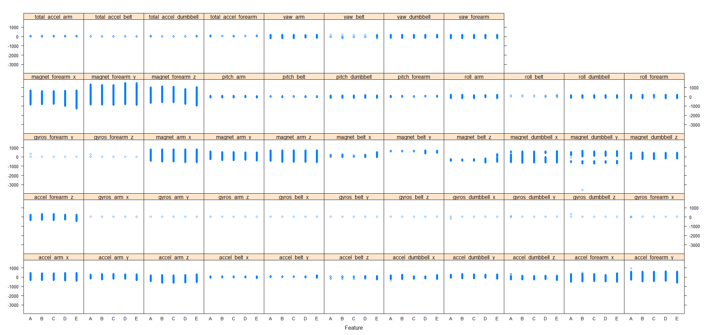
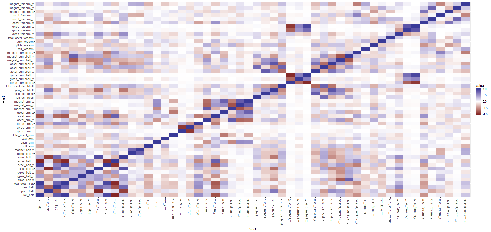

##1. Background  
Using devices such as Jawbone Up, Nike FuelBand, and Fitbit it is now possible to collect a large amount of data about personal activity relatively inexpensively. These type of devices are part of the quantified self movement - a group of enthusiasts who take measurements about themselves regularly to improve their health, to find patterns in their behavior, or because they are tech geeks. One thing that people regularly do is quantify how much of a particular activity they do, but they rarely quantify how well they do it.  
  
The goal of this project, is to use data from accelerometers on the belt, forearm, arm, and dumbell of 6 participants to predict if they performed the activity correctly or incorrectly in 5 different ways (variable "classe"). Class A corresponds to the specified execution of the exercise, while the other 4 classes correspond to common mistakes.  
  
##2. Data Processing  
###2.1 Data and Documentation Source  
The training data used for this analysis is available [here](https://d396qusza40orc.cloudfront.net/predmachlearn/pml-training.csv)  
  
The test data used for this analysis is available [here](https://d396qusza40orc.cloudfront.net/predmachlearn/pml-testing.csv)  
  
The documentation for this analysis is available [here](http://groupware.les.inf.puc-rio.br/har#ixzz4aEDRLc7c)  
  
###2.2 Download and read the data set  
2.2.1 Set global options and load required libraries for the analysis.    
```{r global, message=FALSE, warning=FALSE}
library(caret)
library(rpart)
library(rpart.plot)
library(randomForest)
library(corrplot)
library(reshape2)
library(knitr)
opts_chunk$set(echo = TRUE, results = "hold", fig.width=12, fig.height=8, warning=FALSE, message=FALSE)  
```  
  
2.2.2 The data was downloaded and read into a csv file.  
```{r read, cache=TRUE}
TrainUrl <-"https://d396qusza40orc.cloudfront.net/predmachlearn/pml-training.csv"
TestUrl <- "https://d396qusza40orc.cloudfront.net/predmachlearn/pml-testing.csv"
TrainFile <- "./Data/pml-training.csv"
TestFile <- "./Data/pml-testing.csv"
    
if (!file.exists("./Data")) {
    dir.create("./Data")
}
if (!file.exists(TrainFile)) {
    download.file(TrainUrl, destfile=TrainFile)
}
if (!file.exists(TestFile)) {
    download.file(TestUrl, destfile=TestFile)
}
training <- read.csv("./Data/pml-training.csv", header = T, 
                        na.strings = c("NA","#DIV/0!",""))  
testing <- read.csv("./Data/pml-testing.csv", header = T, 
                         na.strings = c("NA","#DIV/0!",""))
```  
  
##3. Exploratory Data Analysis  
###3.1 Check the dimensions of data frame.  
```{r dim}
dim(training);dim(testing)
```  
  
The training data set consist of 19622 observations and 160 variables, whereas the testing data set has the same number of variables and 20 observations.  
  
###3.2 Clean the data  
The data set were check for any missing values.  
```{r missing}
sum(is.na(training))
sum(is.na(testing))
```  
  
Remove columns (predictors) of the training set that contain any missing values.  
```{r removeNA}
training <- training[, colSums(is.na(training)) == 0]
testing <- testing[, colSums(is.na(testing)) == 0]
```  
  
View the names of the variables  
```{r names}
names(training)
```  
  
Since the analysis requires to use data from accelerometers on the belt, forearm, arm, and dumbell, columns 1 to 7 will be removed from both data sets.  
```{r remove17}
training <- training[, -c(1:7)]
testing <- testing[, -c(1:7)]
```  
  
###3.3 Relationship of variables and classe  
A plot was created to show the relationship between the variables and classes. From the plot below, each features relatively has the same distribution among the 5 outcome levels (A, B, C, D, E).  
```{r plot1, eval=FALSE, results='hide'}
featurePlot(x=training[,1:52], y=training$classe, plot = "strip")
```  
  
  
  
###3.4 Multicollinearity  
A correlation matrix of the variable was done to determine if the variable are highly correlated to each other.  
```{r plot2, eval=c(1:2), results='hide'}
CorPlot <- cor(training[,-length(names(training))])
MeltCorPlot <- melt(CorPlot)
qplot(x=Var1, y=Var2, data=MeltCorPlot, fill=value, geom="tile") +
    scale_fill_gradient2(limits=c(-1, 1)) +
    theme(axis.text.x = element_text(angle=-90, vjust=0.5, hjust=0))
```  
  
    
  
Based on the plot above, the variables do not seem to be highly correlated. Therefore no variables will be removed.  
  
  
##4.0 Prediction Algorithms  
Two different prediction models will used and compared. The selection will be based on the high accuracy and low out-of-sample error.  
  
###4.1 Cross Validation  
The training data is randomly split into a smaller training set and a validation set. This is the simplest and most widely used method for estimating prediction
error.  
```{r partition}
set.seed(100)
inTrain1 <- createDataPartition(training$classe, p = 0.7, list = FALSE)
Strain <- training[inTrain1,]
Svalid <- training[-inTrain1,]
```  
  
```{r removedata, echo=FALSE, results='hide'}
rm(TrainUrl)
rm(TestUrl)
rm(TrainFile)
rm(TestFile)
rm(CorPlot)
```
  
###4.2 Random Forest  
A k-fold cross validation will be used on the Strain set to select the optimal tuning parameters for the random forest model. A 3 fold cross validation will be used since the data set has 13737 observations and this will save some processing time.  
```{r rforrest, cache=TRUE}
kf <- trainControl(method = "cv", number = 3)
ModfitRF <- train(classe ~., data = Strain, method="rf", trControl = kf)
PredRF <- predict(ModfitRF, Svalid)
confusionMatrix(Svalid$classe, PredRF)
```  
  
Based on the results above, the model accuracy is 99.3% and the out-of-sample error rate is 0.7%.  
  
###4.3 Decision Tree  
Similarly as above a 3 fold cross validation will be used.  
```{r dectree, cache=TRUE}
ModfitRP <- train(classe ~., data = Strain, method="rpart", trControl = kf)
PredRP <- predict(ModfitRP, Svalid)
confusionMatrix(Svalid$classe, PredRP)
```  
  
Based on the results above, the model accuracy is 48.45% and the out-of-sample error rate is 51.55%. The decision tree model does not predict the outcome "classe" accurately.  
  
Clearly the random forest model is the more accurate model to perform the predictions.  
    
###4.4 Re-train the selected model on full training data set.  
It is always good to re-train the selected model random forest on the full data set before predicting the test set.  
```{r retrain, cache=TRUE}
set.seed(100)
ModfitRF1 <- train(classe ~., data = training, method="rf", trControl = kf)
```  
  
##5.0 Predictions  
The Random Forest model (ModFitRF1) will be used to make the testing data set predicts.  
```{r predictions}
PredRF1 <- predict(ModfitRF1, testing)
PredRF1
```  
  
##6.0 Reference  
Ugulino, W.; Cardador, D.; Vega, K.; Velloso, E.; Milidiu, R.; Fuks, H. Wearable Computing: Accelerometers' Data Classification of Body Postures and Movements. Proceedings of 21st Brazilian Symposium on Artificial Intelligence. Advances in Artificial Intelligence - SBIA 2012. In: Lecture Notes in Computer Science. , pp. 52-61. Curitiba, PR: Springer Berlin / Heidelberg, 2012. ISBN 978-3-642-34458-9. DOI: 10.1007/978-3-642-34459-6_6.
  
